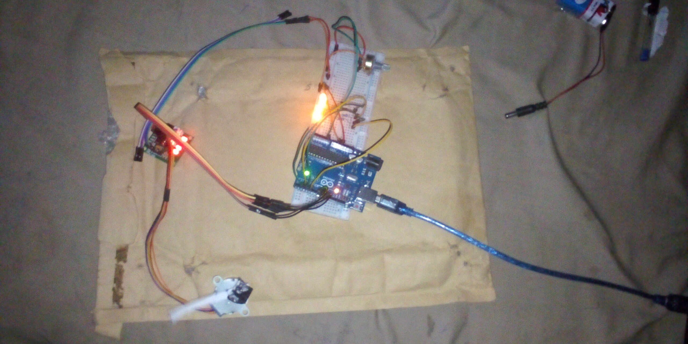

# Stepper Motor Speed Control with Potentiometer and LED Indicators – Arduino Project

## Overview
This project demonstrates how to control the speed of a stepper motor using a potentiometer with Arduino. The motor speed is adjusted in real time, and multiple LEDs act as visual indicators to represent different speed ranges.

## Objective
- Control a stepper motor using Arduino
- Adjust motor speed dynamically using a potentiometer
- Understand RPM calculation and motor speed mapping
- Use LEDs as speed level indicators
- Monitor motor speed through the Serial Monitor

## Components Used
- Arduino Uno
- Stepper Motor (28BYJ-48 or equivalent)
- ULN2003 Stepper Motor Driver
- Potentiometer
- 4 LEDs
- 220Ω resistors
- Breadboard
- Jumper wires
- 9V Battery
- 9V Battery Clip to DC Barrel Jack

## Circuit Diagram

For Other images [CLICK Here](images/)

## How It Works
1. The potentiometer is connected to an analog pin on the Arduino.
2. The analog value from the potentiometer is read and mapped to an RPM value.
3. The Stepper library is used to set the motor speed based on the calculated RPM.
4. The motor rotates forward and backward continuously at the selected speed.
5. LEDs light up progressively to indicate the current speed range:
   - Low speed → 1 LED ON
   - Medium speed → 2–3 LEDs ON
   - High speed → All LEDs ON
6. The current RPM value is displayed on the Serial Monitor.

## Code
The Arduino sketch for this project is located in the [code/ directory](code/stepper_motor_controlled_project_on_7th_november_2025).

## Demo Video
A demonstration video of the working project is included in this repository.

📹 **Project Demonstration:**  
[Click here to watch/download the demo video](video/)

*(If the video does not preview directly on GitHub, please download it using the link above.)*

## Reflection (What I Learned)
- How to control stepper motors using the Stepper library
- Mapping analog input values to motor speed
- Using LEDs as real-time feedback indicators
- Managing motor direction and speed simultaneously

## Challenges Faced
- Proper RPM scaling for smooth motor rotation
- Synchronizing LED indicators with speed levels
- Ensuring stable motor operation at low speeds

## Possible Improvements
- Add an LCD or OLED display for RPM output
- Implement acceleration and deceleration control
- Allow direction control using push buttons
- Add preset speed modes

## Project Status
Completed
